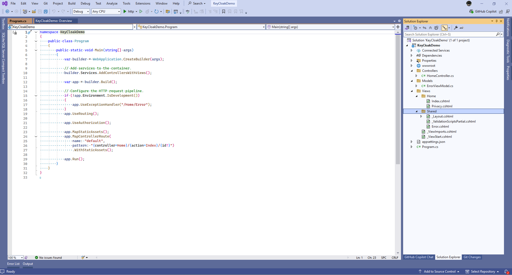

# KeyCloakDemo

This is a simple demo of KeyCloak integration with ASP.NET core.

1. Create a new ASP.NET Core Web Application

    

    

    

    


2. Create a protected action

    2.1 Create a new action in the HomeController called Protected

    ```c#
    public class HomeController : Controller
    {
        private readonly ILogger<HomeController> _logger;

        public HomeController(ILogger<HomeController> logger)
        {
            _logger = logger;
        }

        public IActionResult Index()
        {
            return View();
        }
   
        public IActionResult Privacy()
        {
            return View();
        }

        [ResponseCache(Duration = 0, Location = ResponseCacheLocation.None, NoStore = true)]
        public IActionResult Error()
        {
            return View(new ErrorViewModel { RequestId = Activity.Current?.Id ?? HttpContext.TraceIdentifier });
        }

        public IActionResult Protected()
        {
            return View();
        }
    }
    ```

    2.2 Create a new view for the Protected action
      
      

    ```razor 
        @{
           ViewData["Title"] = "Protected page";
        }

       <p>This is a protected page.</p>
    ```

3. Launch application

    
    
    

3.1 Navigate to the protected page

   

4. Configure authentication

```c#
   public static void Main(string[] args)
   {
            var builder = WebApplication.CreateBuilder(args);

            // Add services to the container.
            builder.Services.AddControllersWithViews();

            // Add authentication services
            builder.Services.AddAuthentication();

            var app = builder.Build();

            // Configure the HTTP request pipeline.
            if (!app.Environment.IsDevelopment())
            {
                app.UseExceptionHandler("/Home/Error");
            }

            app.UseRouting();

            app.UseAuthentication();
            app.UseAuthorization();

            app.MapStaticAssets();
            app.MapControllerRoute(
                name: "default",
                pattern: "{controller=Home}/{action=Index}/{id?}")
                .WithStaticAssets();

            app.Run();
  }
 ```

 5. Decorate Protected action with Authorize attribute

 ```c#
    public class HomeController : Controller
    {
        private readonly ILogger<HomeController> _logger;

        public HomeController(ILogger<HomeController> logger)
        {
            _logger = logger;
        }

        public IActionResult Index()
        {
            return View();
        }
   
        public IActionResult Privacy()
        {
            return View();
        }

        [ResponseCache(Duration = 0, Location = ResponseCacheLocation.None, NoStore = true)]
        public IActionResult Error()
        {
            return View(new ErrorViewModel { RequestId = Activity.Current?.Id ?? HttpContext.TraceIdentifier });
        }

        [Authorize]
        public IActionResult Protected()
        {
            return View();
        }
    }
 ```

6. Setting up Keycloak using postgres database with docker

```yaml
services:
  postgres:
    image: postgres:16
    container_name: keycloak-postgres
    restart: always
    environment:
      POSTGRES_DB: keycloak
      POSTGRES_USER: keycloak
      POSTGRES_PASSWORD: keycloakpassword
    volumes:
      - postgres_data:/var/lib/postgresql/data
    networks:
      - keycloak-network

  keycloak:
    image: quay.io/keycloak/keycloak:24.0
    container_name: keycloak
    depends_on:
      - postgres
    restart: always
    command: start-dev
    environment:
      KC_DB: postgres
      KC_DB_URL_HOST: postgres
      KC_DB_URL_PORT: 5432
      KC_DB_URL_DATABASE: keycloak
      KC_DB_USERNAME: keycloak
      KC_DB_PASSWORD: keycloakpassword
      KC_DB_SCHEMA: public
      KEYCLOAK_ADMIN: admin
      KEYCLOAK_ADMIN_PASSWORD: admin
    ports:
      - "8080:8080"
    networks:
      - keycloak-network

volumes:
  postgres_data:

networks:
  keycloak-network:
 ```

```yml
docker-compose up
 ```

 7. Navigate to Keycloak admin console

    

8. Create a Realm called "demo"

   

9. Create User and assign a password

   
  
 . 

  
 10. Create client called "demo-client"

   
  
 . 

  


 11. Configure authentication
  
 ```c#
using Microsoft.AspNetCore.Authentication.Cookies;
using Microsoft.AspNetCore.Authentication.OpenIdConnect;

namespace KeyCloakDemo
{
    public class Program
    {
        public static void Main(string[] args)
        {
            var builder = WebApplication.CreateBuilder(args);

            // Add services to the container.
            builder.Services.AddControllersWithViews();

            // Add authentication services
            builder.Services.AddAuthentication(options =>
            {
                options.DefaultScheme = CookieAuthenticationDefaults.AuthenticationScheme;
                options.DefaultChallengeScheme = OpenIdConnectDefaults.AuthenticationScheme;
            }).AddCookie(CookieAuthenticationDefaults.AuthenticationScheme)
            .AddOpenIdConnect(OpenIdConnectDefaults.AuthenticationScheme, options =>
            {
                options.Authority = "http://localhost:8080/realms/demo";
                options.ClientId = "demo-client";
                options.ClientSecret = "OGnwSd8A3G4s9CrleCPJUXVpQctWhhZz";
                options.ResponseType = "code";
                options.SaveTokens = true;
                options.RequireHttpsMetadata = false;
                options.GetClaimsFromUserInfoEndpoint = true;
                options.Scope.Add("openid");
                options.Scope.Add("profile");
                options.Scope.Add("email");
                options.TokenValidationParameters.NameClaimType = "name";

                // Add logging for authentication events
                options.Events = new OpenIdConnectEvents
                {
                    OnRedirectToIdentityProvider = context =>
                    {
                        Console.WriteLine($"Redirecting to Keycloak: {context.ProtocolMessage.CreateAuthenticationRequestUrl()}");
                        return Task.CompletedTask;
                    },
                    OnMessageReceived = context =>
                    {
                        Console.WriteLine($"OIDC Message: {context.ProtocolMessage}");
                        return Task.CompletedTask;
                    },
                    OnTokenResponseReceived = context =>
                    {
                        Console.WriteLine($"ID Token: {context.TokenEndpointResponse?.IdToken}");
                        Console.WriteLine($"Access Token: {context.TokenEndpointResponse?.AccessToken}");

                        return Task.CompletedTask;
                    },
                    OnAuthenticationFailed = context =>
                    {
                        Console.WriteLine($"Authentication Failed: {context.Exception.Message}");
                        return Task.CompletedTask;
                    }
                };
            });

            var app = builder.Build();

            // Configure the HTTP request pipeline.
            if (!app.Environment.IsDevelopment())
            {
                app.UseExceptionHandler("/Home/Error");
            }

            app.UseRouting();

            app.UseAuthentication();
            app.UseAuthorization();

            app.MapStaticAssets();
            app.MapControllerRoute(
                name: "default",
                pattern: "{controller=Home}/{action=Index}/{id?}")
                .WithStaticAssets();

            app.Run();
        }
    }
}

 ```

 You are authenticated now ! 

  
 
 

  12. Create a signout action 

   ```c#
public class AuthenticationController : Controller
{
    public async Task Signout()
    {
        await HttpContext.SignOutAsync(CookieAuthenticationDefaults.AuthenticationScheme);
        await HttpContext.SignOutAsync(OpenIdConnectDefaults.AuthenticationScheme);
    }
}
 ```

  
12. Display UserName in Layout 
 
 ```html
       <header>
        <nav class="navbar navbar-expand-sm navbar-toggleable-sm navbar-light bg-white border-bottom box-shadow mb-3">
            <div class="container-fluid">
                <a class="navbar-brand" asp-area="" asp-controller="Home" asp-action="Index">KeyCloakDemo</a>
                <button class="navbar-toggler" type="button" data-bs-toggle="collapse" data-bs-target=".navbar-collapse" aria-controls="navbarSupportedContent"
                        aria-expanded="false" aria-label="Toggle navigation">
                    <span class="navbar-toggler-icon"></span>
                </button>
                <div class="navbar-collapse collapse d-sm-inline-flex justify-content-between">
                    <ul class="navbar-nav flex-grow-1">
                        <li class="nav-item">
                            <a class="nav-link text-dark" asp-area="" asp-controller="Home" asp-action="Index">Home</a>
                        </li>
                        <li class="nav-item">
                            <a class="nav-link text-dark" asp-area="" asp-controller="Home" asp-action="Protected">Protected</a>
                        </li>
                        <li class="nav-item">
                            <a class="nav-link text-dark" asp-area="" asp-controller="Home" asp-action="Privacy">Privacy</a>
                        </li>
                    </ul>
                    @if (User?.Identity?.IsAuthenticated == true)
                    {
                        <ul class="navbar-nav ms-auto">
                            <li class="nav-item">
                                @User.Identity.Name <a class="nav-link text-dark" asp-area="" asp-controller="Authentication" asp-action="Signout">Sign out</a>
                            </li>
                        </ul>
                    }
                </div>
            </div>
        </nav>
    </header>
 ```

 
